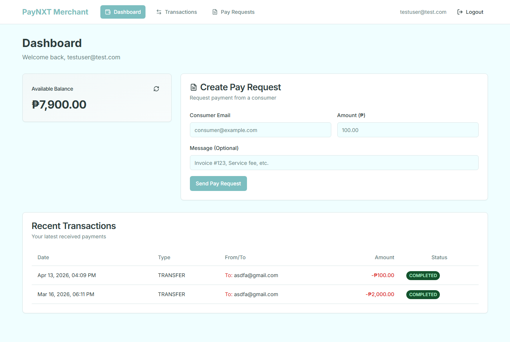
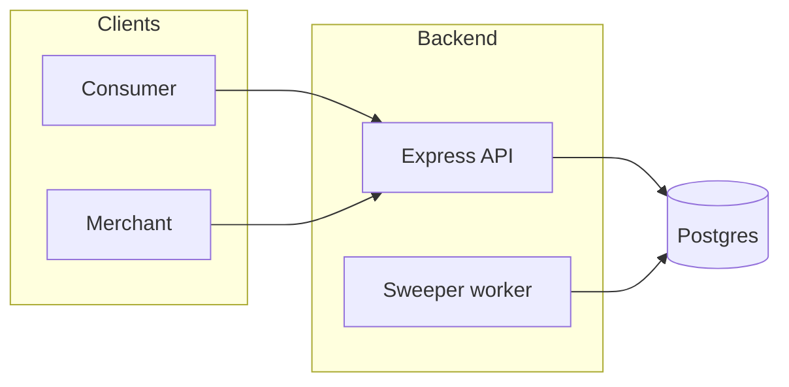

# PayNXT

PayNXT is a payments-style monorepo: JWT auth, user balances, transfers, merchant pay requests, and a background worker that settles pending transactions all in one place.

## Live demo

- Consumer app — [https://consumer.paynxt.curr.xyz](https://consumer.paynxt.curr.xyz)
- Merchant app — [https://merchant.paynxt.curr.xyz](https://merchant.paynxt.curr.xyz)

## Features

- Consumer and merchant sign-up and login (JWT)
- Balance and user profile APIs
- Money transfers and pay-request flows (pending → completed/failed via worker)
- Rate-limited Express API with shared Prisma schema

## Preview



## Tech stack

- **Monorepo:** pnpm workspaces + Turborepo
- **Web:** Next.js 15 (App Router) + TypeScript + Tailwind CSS + TanStack Query
- **API:** Node.js + Express + Zod + JWT
- **Data:** Prisma + PostgreSQL
- **Worker:** TypeScript service that polls and processes pending transactions

## Cloud architecture (production)

High-level layout: two Next.js frontends and the REST API talk to the same database; the sweeper runs as a separate process and completes pending transfers.




## Local setup

1. **Requirements:** Node.js 18+ and pnpm (repo pins `pnpm@10.26.0` via Corepack).

1. **Install dependencies** (from repo root):

```bash
pnpm install
```


**Database schema**

```bash
pnpm db:generate
pnpm db:push
```

**Run everything in dev** (Turbo runs all app dev scripts):

```bash
pnpm dev
```

**Open the apps**

   - Consumer — [http://localhost:3000](http://localhost:3000)
   - Merchant — [http://localhost:3002](http://localhost:3002)

### API + sweeper with Docker

From the repo root (with `apps/api/.env` and `apps/sweeper/.env` present):

```bash
docker compose up --build
```

The API is exposed on [http://localhost:4000](http://localhost:4000) per `docker-compose.yml`; point `NEXT_PUBLIC_API_URL` at that URL if the Next apps run on the host while the API runs in Docker.
